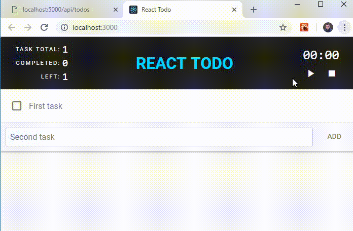

# react-basic

1. Clone repository
2. Install pacckages: <code>npm i</code>
3. Start node server: <code>node api</code>. The server stores data in JSON format.
4. Start app: <code>npm start</code>

### Screenshot
